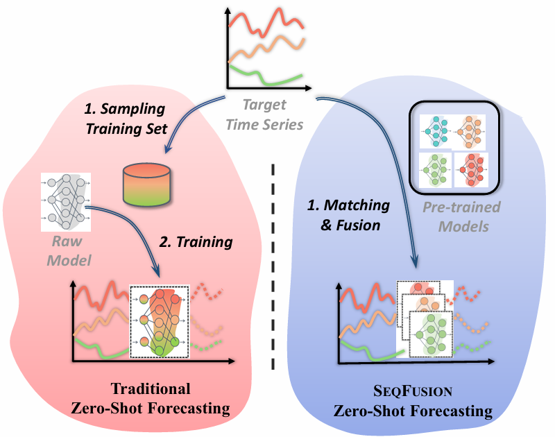

<div align="center">
  </a>
</div>


&nbsp;

<div align="center">
    .svg?style=for-the-badge" alt="Generic badge", height="21">
</div>
<h3 align="center">
    <p>
        SEQFUSION: Sequential Fusion of Pre-Trained Models for Zero-Shot Time-Series Forecasting
    <p>
</h3>
<h4 align="center">
    <p>
        📑 <a href="https://arxiv.org/abs/xxx">[Paper]</a> [<b>Code</b>]</a>
    <p>
<!--     <p>
        <b>English</b> |
        <a href="https://github.com/zhangyikaii/Model-Spider/edit/main/README_CN.md">中文</a>
    <p> -->
</h4>

<details>
    <summary>Detailed Introduction</summary>
    <p>
    SEQFUSION, a novel framework that collects and fuses diverse pre-trained models (PTMs) sequentially for <b>zero-shot forecasting without collecting diverse pre-training data</b>. 
    <br>
    <br>
    Based on the specific temporal characteristics of the target time series, SEQFUSION <b>selects the most suitable PTMs for your data</b>, performs sequential predictions, and fuses all the predictions while using minimal data to protect privacy. Experiments demonstrate that SEQFUSION achieves competitive
    accuracy in zero-shot forecasting compared to state-of-the-art methods
    </p>
</details>

In this repo, you can figure out:
* **Achieving SOTA zero-shot forecating performance with a few lightweight pre-trained models**.
* Implementations of **Pre-trained Model Selection** for time-series forecasting, and enjoy its user-friendly inference capabilities.
* Feel free to **customize** the application scenarios of **SeqFusion**!
<!--
* **A pre-trained model zoo** containing **10** lightwieght models (PatchTST architecture), fine-tuned on **3** downstream datasets ().
-->

&nbsp;

## Table of Contents
- [Table of Contents](#table-of-contents)
- [Zero-shot Forecasting Performance](#zero-shot-forecasting-performance)
- [Code Implementation](#code-implementation)
- [Reproduce for Other Baseline Methods](#reproduce-for-other-baseline-methods)
- [Contributing](#contributing)

&nbsp;

## Zero-shot Forecasting Performance

Performance comparisons of **3 kinds of baseline approaches** and SeqFusion on 7 multivariate datasets with MSE. We denote the best-performing results in **bold**.

<table border="1">
  <tr>
    <th>Methods</th>
    <th>Resource Type</th>
    <th>ECL</th>
    <th>ETTh1</th>
    <th>ETTh2</th>
    <th>Exchange</th>
    <th>Illness</th>
    <th>Traffic</th>
    <th>Weather</th>
    <th>Memory Storage (MB) (Data + Model)</th>
  </tr>
  <tr>
    <td>Last</td>
    <td>-</td>
    <td>0.7360</td>
    <td>0.7640</td>
    <td>0.2639</td>
    <td><b>0.0217</b></td>
    <td>4.7867</td>
    <td>2.2498</td>
    <td>1.4799</td>
    <td>-</td>
  </tr>
  <tr>
    <td>Mean</td>
    <td></td>
    <td>0.6755</td>
    <td>0.6134</td>
    <td>0.30376</td>
    <td>0.0376</td>
    <td>4.8981</td>
    <td>1.3565</td>
    <td><b>1.4063</b></td>
    <td>-</td>
  </tr>
  <tr>
    <td>SeasonalNaive</td>
    <td></td>
    <td>0.6091</td>
    <td>0.8539</td>
    <td>0.3315</td>
    <td>0.0272</td>
    <td>6.0760</td>
    <td>1.2227</td>
    <td>1.6105</td>
    <td>-</td>
  </tr>
  <tr>
    <td>Arima</td>
    <td rowspan="9">In-Task Data</td>
    <td>3.6648</td>
    <td>0.6389</td>
    <td>1.0048</td>
    <td>10.1624</td>
    <td>5.8628</td>
    <td>2.4790</td>
    <td>3.1264</td>
    <td>0.01 + 30.27</td>
  </tr>
  <tr>
    <td>Prophet</td>
    <td>10.2358</td>
    <td>6.1366</td>
    <td>10.1677</td>
    <td>229.8594</td>
    <td>9.1147</td>
    <td>3.8610</td>
    <td>2.9049</td>
    <td>0.01 + 3.270</td>
  </tr>
  <tr>
    <td>Transformer</td>
    <td>1.3429</td>
    <td>0.6875</td>
    <td>0.9457</td>
    <td>1.5532</td>
    <td>5.0526</td>
    <td>1.9362</td>
    <td>2.1727</td>
    <td>0.01 + 64.06</td>
  </tr>
  <tr>
    <td>Autoformer</td>
    <td>0.8861</td>
    <td>0.8519</td>
    <td>0.5835</td>
    <td>0.1950</td>
    <td>4.5547</td>
    <td>1.4316</td>
    <td>1.7660</td>
    <td>0.01 + 65.88</td>
  </tr>
  <tr>
    <td>FEDformer</td>
    <td>0.9156</td>
    <td>0.7561</td>
    <td>0.4061</td>
    <td>0.2478</td>
    <td>4.6087</td>
    <td>1.5551</td>
    <td>1.6792</td>
    <td>0.01 + 66.93</td>
  </tr>
  <tr>
    <td>Informer</td>
    <td>1.3743</td>
    <td>0.7870</td>
    <td>0.8497</td>
    <td>1.5969</td>
    <td>5.3082</td>
    <td>2.1612</td>
    <td>2.3070</td>
    <td>0.01 + 67.07</td>
  </tr>
  <tr>
    <td>DLinear</td>
    <td>0.6942</td>
    <td>0.6732</td>
    <td>0.3470</td>
    <td>0.0559</td>
    <td>3.5083</td>
    <td>1.3655</td>
    <td>1.4644</td>
    <td>0.01 + 0.55</td>
  </tr>
  <tr>
    <td>PatchTST</td>
    <td>0.6184</td>
    <td>0.7333</td>
    <td>0.4006</td>
    <td>0.0544</td>
    <td>3.9034</td>
    <td>1.1661</td>
    <td>1.4877</td>
    <td>0.01 + 27.17</td>
  </tr>
  <tr>
    <td>iTransformer</td>
    <td>0.6067</td>
    <td>0.7183</td>
    <td>0.3345</td>
    <td>0.0315</td>
    <td>3.5232</td>
    <td><b>1.1306</b></td>
    <td>1.5676</td>
    <td>0.01 + 26.15</td>
  </tr>
  <tr>
    <td>Meta-N-BEATS</td>
    <td rowspan="3">Pre-Train Data</td>
    <td>0.7576</td>
    <td>0.7175</td>
    <td>0.0469</td>
    <td>4.6405</td>
    <td>2.2361</td>
    <td>1.4648</td>
    <td>1.4488</td>
    <td>1.70 + 95.85</td>
  </tr>
  <tr>
    <td>GPT4TS</td>
    <td>0.7548</td>
    <td>0.6961</td>
    <td>0.3397</td>
    <td>0.0226</td>
    <td>3.7603</td>
    <td>1.4777</td>
    <td>1.4777</td>
    <td>1.70 + 74.83</td>
  </tr>
  <tr>
    <td>ForecastPFN</td>
    <td>0.9511</td>
    <td>1.1851</td>
    <td>0.5144</td>
    <td>0.0579</td>
    <td>4.8880</td>
    <td>1.7894</td>
    <td>1.8770</td>
    <td>* + 23.50</td>
  </tr>
  <tr>
    <td><b>SEQFUSION</b></td>
    <td><b>PTMs</b></td>
    <td><b>0.6029</b></td>
    <td><b>0.6001</b></td>
    <td><b>0.2450</b></td>
    <td><b>0.0217</b></td>
    <td><b>3.4956</b></td>
    <td>1.4889</td>
    <td>1.4488</td>
    <td>0.02 + 23.10</td>
  </tr>
</table>


**Table**: Performance comparison of various zero-shot forecasting methods across different datasets, including classical statistical methods,deep learning models trained on 50 in-task timesteps data and zero-shot methods requiring pre-training data.

More results can be found in the paper.

&nbsp;

## Code Implementation

- Set up the environment:
    ```bash
    git clone https://github.com/Tingji2419/SeqFusion.git
    cd SeqFusion
    pip install -r requirements.txt
    ```

- Download the data and pre-trained model zoo for SeqFusion [here](https://drive.google.com/drive/folders/1FalRR8I4AnDqVyL4V8K_9Mt0yu0u3S8I?usp=sharing), and then unzip them directly.
- Run the code for SeqFusion:
    ```shell
    bash command_benchmark1.sh
    ```
- Collect SeqFusion results:
    ```shell
    python check_result.sh
    ```
    The results will be displayed on the screen.
&nbsp;


## Reproduce for Other Baseline Methods

Coming soon.


## Contributing

SeqFusion is currently in active development, and we warmly welcome any contributions aimed at enhancing capabilities. Whether you have insights to share regarding pre-trained models, data, or innovative ranking methods, we eagerly invite you to join us in making SeqFusion even better.

&nbsp;
<!-- 
## Citing Model Spider

```latex
@inproceedings{ModelSpiderNeurIPS23,
  author    = {Yi{-}Kai Zhang and
               Ting{-}Ji Huang and
               Yao{-}Xiang Ding and
               De{-}Chuan Zhan and
               Han{-}Jia Ye},
  title     = {Model Spider: Learning to Rank Pre-Trained Models Efficiently},
  booktitle = {Advances in Neural Information Processing Systems 36: Annual Conference
               on Neural Information Processing Systems 2023, NeurIPS 2023, New Orleans,
               LA, USA, December 10 - 16, 2023},
  year      = {2023},
}
``` -->